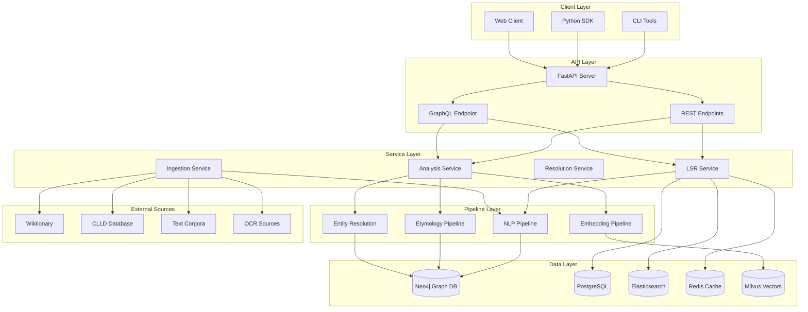
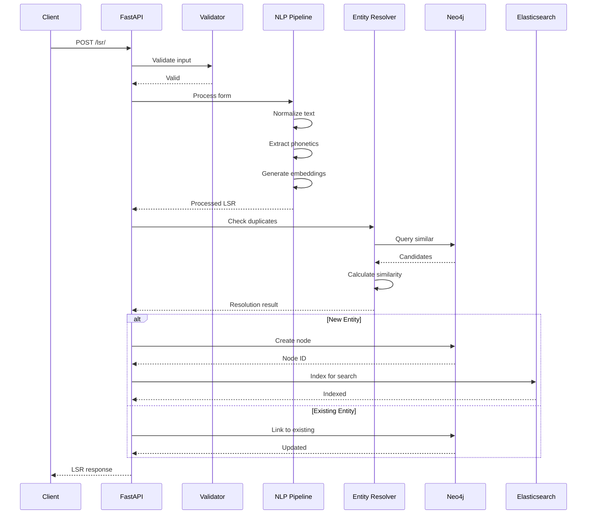
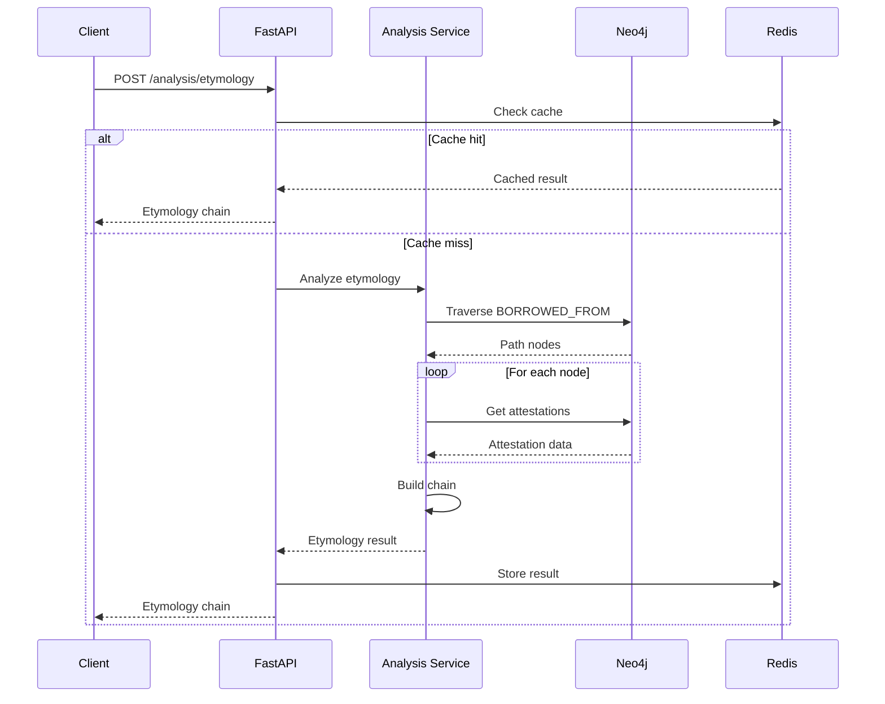
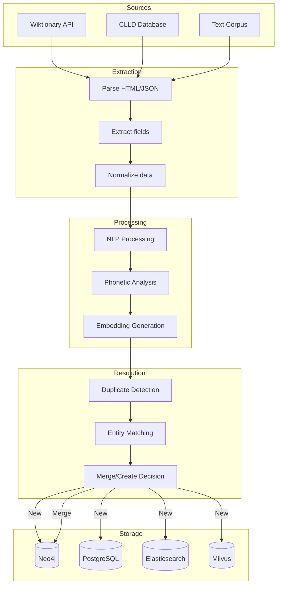
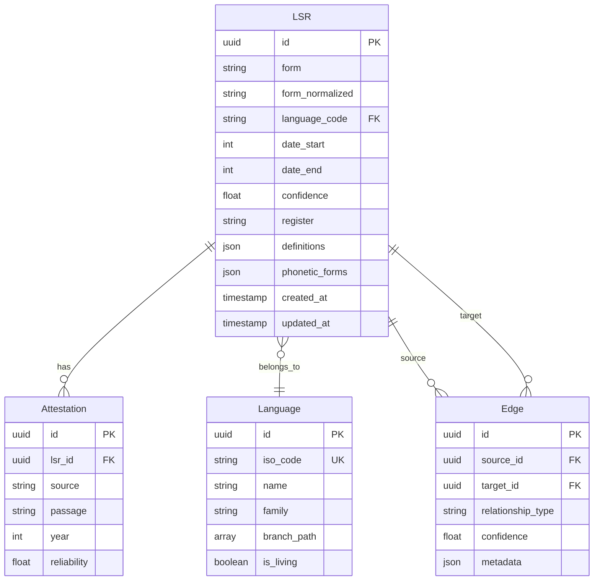
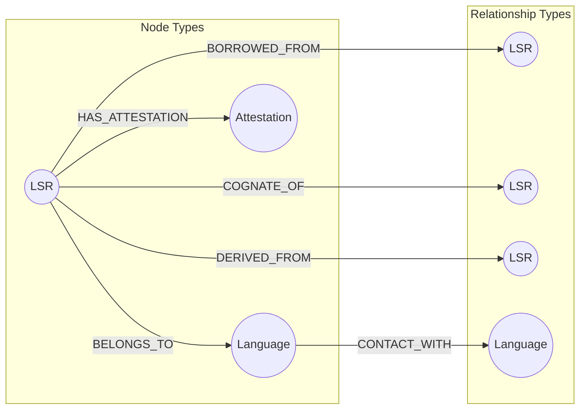
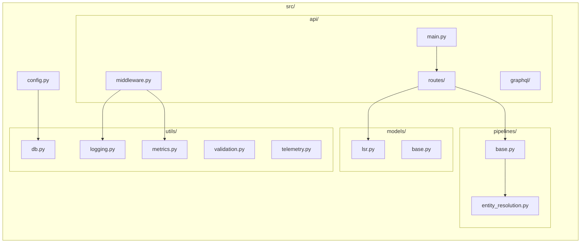
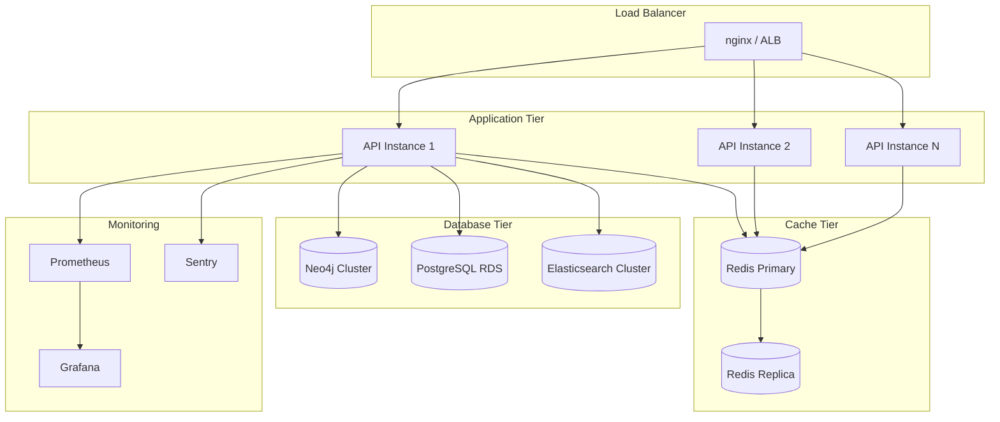
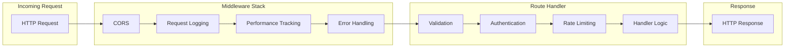

# Architecture Documentation

This document provides comprehensive architecture diagrams and documentation for the Linguistic Stratigraphy system.

## System Overview

The Linguistic Stratigraphy system is designed as a set of loosely coupled services organized into four main layers:

1. **Orchestration Layer** - Workflow management (Airflow/Prefect)
2. **Ingestion Pipeline** - Data source adapters
3. **Processing Pipeline** - Entity resolution, relationship extraction, validation
4. **Serving Layer** - REST API, GraphQL, WebSocket

## High-Level Architecture Diagram



## Storage Layer

The system uses multiple specialized databases:

- **Neo4j/ArangoDB** - Graph storage for LSRs and relationships
- **PostgreSQL** - Metadata, job tracking, validation queues
- **Elasticsearch** - Full-text search
- **Milvus/Pinecone** - Vector embeddings
- **Redis** - Caching and queues

## Data Flow

```
Sources → Adapters → Entity Resolution → Relationship Extraction → Validation → Graph
                                                                              ↓
                                        API ← Training Pipelines ← Embeddings ←
```

## Key Components

### Source Adapters
- `WiktionaryAdapter` - Wiktionary dumps and API
- `CLLDAdapter` - CLICS, WOLD, ASJP
- `CorpusAdapter` - Historical text corpora
- `OCRAdapter` - Digitized manuscripts

### Processing Pipelines
- `EntityResolver` - Deduplication and matching
- `RelationshipExtractor` - Etymology parsing, cognate detection
- `Validator` - Schema, consistency, anomaly detection
- `EmbeddingPipeline` - Semantic vector generation

### Training Pipelines
- `DiachronicEmbeddingTrainer` - Time-aware embeddings
- `ClassifierTrainer` - Text dating, contact detection
- `PhylogeneticInference` - Language tree reconstruction

### Analysis Modules
- `TextDating` - Date prediction and anachronism detection
- `ContactDetector` - Language contact event detection
- `SemanticDriftAnalyzer` - Meaning change tracking

## Deployment

### Development
Use Docker Compose for local development. See `docker-compose.yml`.

### Production
Kubernetes deployment with separate namespaces:
- `ls-serving` - API services
- `ls-data` - Database services
- `ls-compute` - Processing workers
- `ls-monitoring` - Observability stack

## Scheduled Jobs

- **Daily** (2 AM): Incremental ingestion from Wiktionary
- **Weekly** (Sunday): Full dump processing, embedding retrain
- **Monthly** (1st): Phylogenetic tree reconstruction

## Data Flow Diagrams

### LSR Creation Flow



### Etymology Analysis Flow



### Ingestion Pipeline Flow



## Database Schema

### Entity Relationship Diagram



### Neo4j Graph Model



## Component Structure



## Deployment Architecture



## Request Processing Flow



## Technology Stack Summary

| Layer | Technology | Purpose |
|-------|------------|---------|
| API Framework | FastAPI | REST + GraphQL endpoints |
| Graph Database | Neo4j | Lexical relationships |
| Relational DB | PostgreSQL | Metadata, users, jobs |
| Search Engine | Elasticsearch | Full-text search |
| Vector Store | Milvus | Semantic similarity |
| Cache | Redis | Session, query cache |
| NLP | spaCy, Stanza | Text processing |
| ML | Transformers | Embeddings |
| Orchestration | Airflow | Data pipelines |
| Monitoring | Prometheus + Grafana | Metrics |
| Error Tracking | Sentry | Error reporting |
