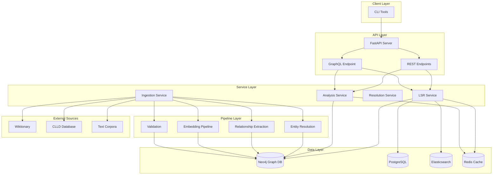
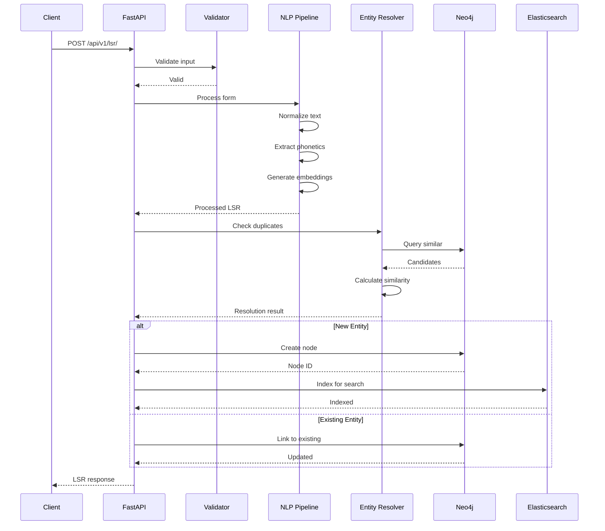
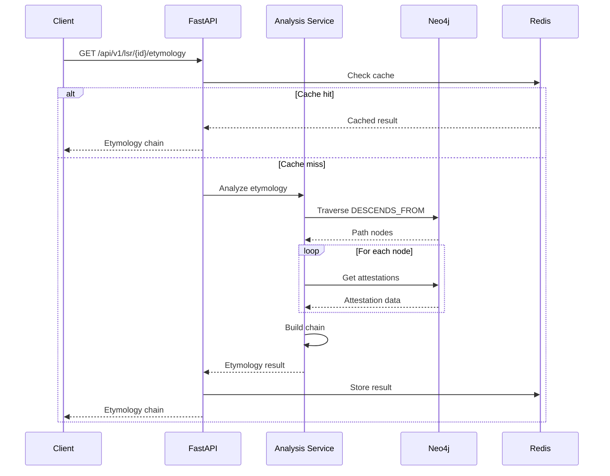
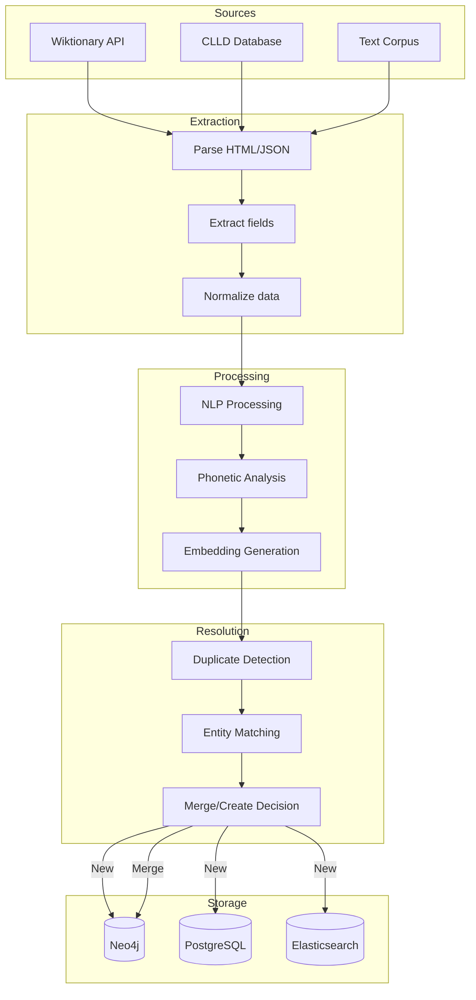
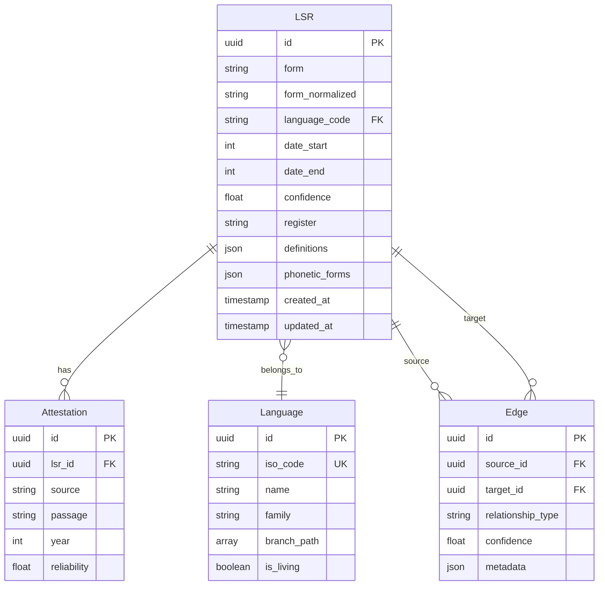
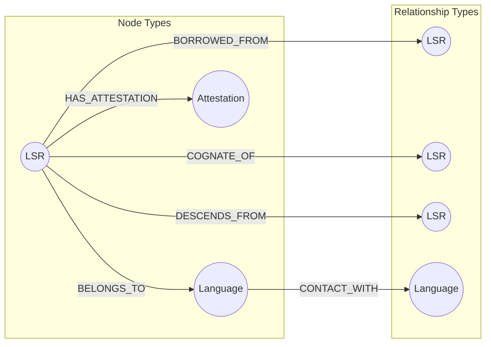
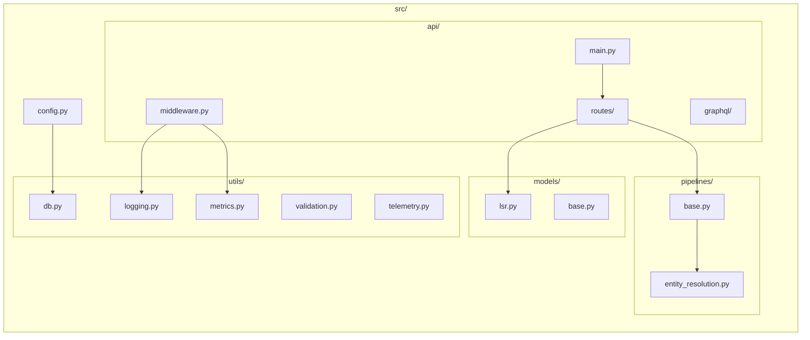
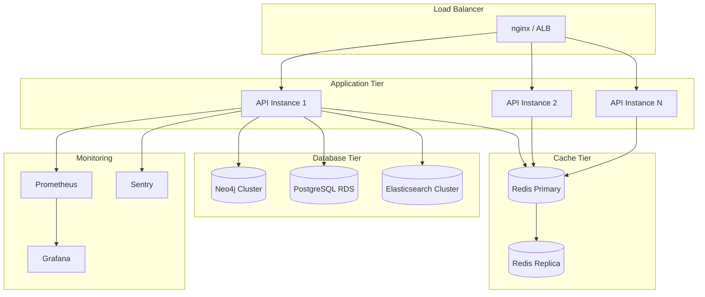
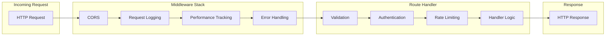

# Architecture Documentation

This document provides comprehensive architecture diagrams and documentation for the Linguistic Stratigraphy system.

## System Overview

The Linguistic Stratigraphy system is designed as a set of loosely coupled services organized into four main layers:

1. **Ingestion Pipeline** - Data source adapters (Wiktionary, CLLD, Corpus)
2. **Processing Pipeline** - Entity resolution, relationship extraction, validation
3. **Serving Layer** - REST API, GraphQL
4. **Storage Layer** - Neo4j, PostgreSQL, Elasticsearch, Redis

## High-Level Architecture Diagram


```mermaid
graph TB
    subgraph "Client Layer"
        CLI[CLI Tools]
    end

    subgraph "API Layer"
        API[FastAPI Server]
        GQL[GraphQL Endpoint]
        REST[REST Endpoints]
    end

    subgraph "Service Layer"
        LSR[LSR Service]
        ANA[Analysis Service]
        RES[Resolution Service]
        ING[Ingestion Service]
    end

    subgraph "Pipeline Layer"
        ENT[Entity Resolution]
        REL[Relationship Extraction]
        EMB[Embedding Pipeline]
        VALID[Validation]
    end

    subgraph "Data Layer"
        NEO[(Neo4j Graph DB)]
        PG[(PostgreSQL)]
        ES[(Elasticsearch)]
        REDIS[(Redis Cache)]
    end

    subgraph "External Sources"
        WIK[Wiktionary]
        CLLD[CLLD Database]
        CORP[Text Corpora]
    end

    CLI --> API

    API --> REST
    API --> GQL

    REST --> LSR
    REST --> ANA
    GQL --> LSR
    GQL --> ANA

    LSR --> NEO
    LSR --> PG
    LSR --> ES
    LSR --> REDIS

    ANA --> NEO
    ANA --> REDIS

    ING --> WIK
    ING --> CLLD
    ING --> CORP

    ING --> ENT
    ING --> REL
    ING --> EMB
    ING --> VALID

    ENT --> NEO
    REL --> NEO
    EMB --> NEO
    VALID --> NEO
```

## Storage Layer

The system uses multiple specialized databases:

- **Neo4j** - Graph storage for LSRs and relationships
- **PostgreSQL** - Metadata, job tracking, validation queues
- **Elasticsearch** - Full-text search
- **Redis** - Caching and queues

## Data Flow

```
Sources → Adapters → Entity Resolution → Relationship Extraction → Validation → Graph
                                                                              ↓
                                        API ← Training Pipelines ← Embeddings ←
```

## Key Components

### Source Adapters
- `WiktionaryAdapter` - Wiktionary dumps and API
- `CLLDAdapter` - CLICS, WOLD, ASJP
- `CorpusAdapter` - Historical text corpora

### Processing Pipelines
- `EntityResolver` - Deduplication and matching
- `RelationshipExtractor` - Etymology parsing, cognate detection
- `Validator` - Schema, consistency, anomaly detection
- `EmbeddingPipeline` - Semantic vector generation

### Analysis Modules
- `TextDating` - Date prediction and anachronism detection
- `ContactDetector` - Language contact event detection
- `SemanticDriftAnalyzer` - Meaning change tracking

## Deployment

### Development
Use Docker Compose for local development. See `docker-compose.yml`.

### Production
Use `make run-api-prod` to run with multiple workers, or build the Docker image for containerized deployment.

## Data Flow Diagrams

### LSR Creation Flow


```mermaid
sequenceDiagram
    participant C as Client
    participant API as FastAPI
    participant VAL as Validator
    participant NLP as NLP Pipeline
    participant ER as Entity Resolver
    participant NEO as Neo4j
    participant ES as Elasticsearch

    C->>API: POST /api/v1/lsr/
    API->>VAL: Validate input
    VAL-->>API: Valid

    API->>NLP: Process form
    NLP->>NLP: Normalize text
    NLP->>NLP: Extract phonetics
    NLP->>NLP: Generate embeddings
    NLP-->>API: Processed LSR

    API->>ER: Check duplicates
    ER->>NEO: Query similar
    NEO-->>ER: Candidates
    ER->>ER: Calculate similarity
    ER-->>API: Resolution result

    alt New Entity
        API->>NEO: Create node
        NEO-->>API: Node ID
        API->>ES: Index for search
        ES-->>API: Indexed
    else Existing Entity
        API->>NEO: Link to existing
        NEO-->>API: Updated
    end

    API-->>C: LSR response
```

### Etymology Analysis Flow


```mermaid
sequenceDiagram
    participant C as Client
    participant API as FastAPI
    participant ANA as Analysis Service
    participant NEO as Neo4j
    participant CACHE as Redis

    C->>API: GET /api/v1/lsr/{id}/etymology
    API->>CACHE: Check cache

    alt Cache hit
        CACHE-->>API: Cached result
        API-->>C: Etymology chain
    else Cache miss
        API->>ANA: Analyze etymology
        ANA->>NEO: Traverse DESCENDS_FROM
        NEO-->>ANA: Path nodes

        loop For each node
            ANA->>NEO: Get attestations
            NEO-->>ANA: Attestation data
        end

        ANA->>ANA: Build chain
        ANA-->>API: Etymology result
        API->>CACHE: Store result
        API-->>C: Etymology chain
    end
```

### Ingestion Pipeline Flow


```mermaid
flowchart TD
    subgraph "Sources"
        S1[Wiktionary API]
        S2[CLLD Database]
        S3[Text Corpus]
    end

    subgraph "Extraction"
        E1[Parse HTML/JSON]
        E2[Extract fields]
        E3[Normalize data]
    end

    subgraph "Processing"
        P1[NLP Processing]
        P2[Phonetic Analysis]
        P3[Embedding Generation]
    end

    subgraph "Resolution"
        R1[Duplicate Detection]
        R2[Entity Matching]
        R3[Merge/Create Decision]
    end

    subgraph "Storage"
        D1[(Neo4j)]
        D2[(PostgreSQL)]
        D3[(Elasticsearch)]
    end

    S1 --> E1
    S2 --> E1
    S3 --> E1

    E1 --> E2 --> E3
    E3 --> P1

    P1 --> P2 --> P3
    P3 --> R1

    R1 --> R2 --> R3

    R3 -->|New| D1
    R3 -->|New| D2
    R3 -->|New| D3
    R3 -->|Merge| D1
```

## Database Schema

### Entity Relationship Diagram


```mermaid
erDiagram
    LSR {
        uuid id PK
        string form
        string form_normalized
        string language_code FK
        int date_start
        int date_end
        float confidence
        string register
        json definitions
        json phonetic_forms
        timestamp created_at
        timestamp updated_at
    }

    Language {
        uuid id PK
        string iso_code UK
        string name
        string family
        array branch_path
        boolean is_living
    }

    Attestation {
        uuid id PK
        uuid lsr_id FK
        string source
        string passage
        int year
        float reliability
    }

    Edge {
        uuid id PK
        uuid source_id FK
        uuid target_id FK
        string relationship_type
        float confidence
        json metadata
    }

    LSR ||--o{ Attestation : "has"
    LSR }o--|| Language : "belongs_to"
    LSR ||--o{ Edge : "source"
    LSR ||--o{ Edge : "target"
```

### Neo4j Graph Model


```mermaid
graph LR
    subgraph "Node Types"
        LSR1((LSR))
        LANG1((Language))
        ATT1((Attestation))
    end

    subgraph "Relationship Types"
        LSR1 -->|BORROWED_FROM| LSR2((LSR))
        LSR1 -->|COGNATE_OF| LSR3((LSR))
        LSR1 -->|DESCENDS_FROM| LSR4((LSR))
        LSR1 -->|BELONGS_TO| LANG1
        LSR1 -->|HAS_ATTESTATION| ATT1
        LANG1 -->|CONTACT_WITH| LANG2((Language))
    end
```

## Component Structure


```mermaid
graph LR
    subgraph "src/"
        subgraph "api/"
            MAIN[main.py]
            ROUTES[routes/]
            MW[middleware.py]
            GQL_S[graphql/]
        end

        subgraph "models/"
            LSR_M[lsr.py]
            BASE[base.py]
        end

        subgraph "pipelines/"
            PIPE_B[base.py]
            ENT_R[entity_resolution.py]
        end

        subgraph "utils/"
            DB[db.py]
            LOG[logging.py]
            VAL[validation.py]
            MET[metrics.py]
            TEL[telemetry.py]
        end

        CONFIG[config.py]
    end

    MAIN --> ROUTES
    ROUTES --> LSR_M
    ROUTES --> PIPE_B
    PIPE_B --> ENT_R
    CONFIG --> DB
    MW --> LOG
    MW --> MET
```

## Deployment Architecture


```mermaid
graph TB
    subgraph "Load Balancer"
        LB[nginx / ALB]
    end

    subgraph "Application Tier"
        API1[API Instance 1]
        API2[API Instance 2]
        API3[API Instance N]
    end

    subgraph "Cache Tier"
        REDIS1[(Redis Primary)]
        REDIS2[(Redis Replica)]
    end

    subgraph "Database Tier"
        NEO_C[(Neo4j Cluster)]
        PG_C[(PostgreSQL RDS)]
        ES_C[(Elasticsearch Cluster)]
    end

    subgraph "Monitoring"
        PROM[Prometheus]
        GRAF[Grafana]
        SENT[Sentry]
    end

    LB --> API1
    LB --> API2
    LB --> API3

    API1 --> REDIS1
    API2 --> REDIS1
    API3 --> REDIS1
    REDIS1 --> REDIS2

    API1 --> NEO_C
    API1 --> PG_C
    API1 --> ES_C

    API1 --> PROM
    PROM --> GRAF
    API1 --> SENT
```

## Request Processing Flow


```mermaid
flowchart LR
    subgraph "Incoming Request"
        REQ[HTTP Request]
    end

    subgraph "Middleware Stack"
        M1[CORS]
        M2[Request Logging]
        M3[Performance Tracking]
        M4[Error Handling]
    end

    subgraph "Route Handler"
        VAL[Validation]
        AUTH[Authentication]
        RATE[Rate Limiting]
        HAND[Handler Logic]
    end

    subgraph "Response"
        RES[HTTP Response]
    end

    REQ --> M1 --> M2 --> M3 --> M4
    M4 --> VAL --> AUTH --> RATE --> HAND
    HAND --> RES
```

## Technology Stack Summary

| Layer | Technology | Purpose |
|-------|------------|---------|
| API Framework | FastAPI | REST + GraphQL endpoints |
| GraphQL | Strawberry | GraphQL schema and resolvers |
| Graph Database | Neo4j | Lexical relationships |
| Relational DB | PostgreSQL | Metadata and job tracking |
| Search Engine | Elasticsearch | Full-text search |
| Cache | Redis | Query and result caching |
| Validation | Pydantic | Data validation and settings |
| Error Tracking | Sentry | Error reporting |
