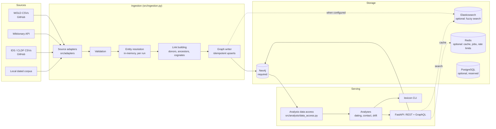

# Architecture

Lexicon has two halves that meet in a Neo4j graph: an **ingestion pipeline**
that turns open lexical datasets into dated word records and links, and a
**serving layer** (CLI, REST, GraphQL) that runs analyses over that graph.

```mermaid
graph LR
    subgraph Sources
        WOLD[WOLD CSVs<br/>GitHub]
        WIKT[Wiktionary API]
        IDS[IDS / CLDF CSVs<br/>GitHub]
        CORP[Local dated corpus]
    end

    subgraph "Ingestion (src/ingestion.py)"
        AD[Source adapters<br/>src/adapters]
        VAL[Validation]
        ER[Entity resolution<br/>in-memory, per run]
        LINK[Link building<br/>donors, ancestors, cognates]
        GW[Graph writer<br/>idempotent upserts]
    end

    subgraph Storage
        NEO[(Neo4j<br/>required)]
        ES[(Elasticsearch<br/>optional: fuzzy search)]
        RD[(Redis<br/>optional: cache, jobs, rate limits)]
        PG[(PostgreSQL<br/>optional, reserved)]
    end

    subgraph Serving
        DA[Analysis data access<br/>src/analysis/data_access.py]
        AN[Analyses<br/>dating, contact, drift]
        CLI[lexicon CLI]
        API[FastAPI: REST + GraphQL]
    end

    WOLD & WIKT & IDS & CORP --> AD --> VAL --> ER --> LINK --> GW
    GW --> NEO
    GW -. when configured .-> ES
    NEO --> DA --> AN
    AN --> CLI & API
    API --> NEO
    API -. search .-> ES
    API -. cache .-> RD
```

## Ingestion

`lexicon ingest --source {wold,wiktionary,clics,corpus}` (also `python -m
src.ingestion`) runs one pass per source:

1. **Adapters** (`src/adapters/`) produce `RawLexicalEntry` objects: form,
   language, definitions, earliest attestation year, and `related_forms`
   links (WOLD donor words; Wiktionary `{{inh}}`/`{{bor}}`/`{{der}}`/`{{cog}}`
   templates, except those that name no term, such as `{{bor|en|fr}}`).
2. **Validation** (`src/pipelines/validation.py`) rejects entries without a
   form or language code.
3. **Entity resolution** (`src/pipelines/entity_resolution.py`) merges
   duplicates within the run and converts entries into LSRs. Its only
   candidates are records with the same normalized form and language. A
   fuzzy or phonetic look-alike would score below even the threshold for
   flagging a possible duplicate, so none are looked up, and resolution
   stays linear (a dry run of all of WOLD takes about 30 seconds). A year
   outside -10000..2100 is dropped with a warning; an undated LSR has
   `date_confidence` 0.0. LSR ids are derived from the source record
   (`uuid5`), so re-running a source updates the same nodes.
4. **Link building** (`src/ingestion.py`) turns `related_forms` into edges.
   Wiktionary etymologies form a chain (word → Middle English → Old English →
   Proto-Germanic). A target with the same language and normalized form as a
   record of the run links to that record; any other target becomes an
   undated placeholder LSR whose id is derived from its language and form,
   so every run that links to the same word reuses the same node.
5. **Graph writer** (`src/pipelines/graph_writer.py`) creates constraints and
   indexes, upserts LSRs with `UNWIND … MERGE`, upserts edges, and bulk-indexes
   the LSRs into Elasticsearch when it is configured. Placeholders are
   written fill-only: a node that already exists keeps every property that
   is set, gains the missing ones and merges the sources, so a later run
   never blanks an earlier run's gloss or provenance (see
   [data_model.md](data_model.md#relationships)). Each batch of 500 LSRs is
   one query with a 15 s server-side timeout. If part of the write fails,
   the summary reports `Failed to write: …` and `lexicon ingest` exits with
   status 1. If Elasticsearch is configured but unreachable, it logs one
   warning and writes to Neo4j only; if it rejects some records, the summary
   says `` N LSRs not indexed; run `lexicon reindex` ``. Run `lexicon
   reindex` once Elasticsearch is up (the API also rebuilds the index when
   it connects to Elasticsearch and the index holds fewer documents than
   Neo4j has LSRs).
   `--dry-run` runs steps 1–4 and skips this step.

Resolution only sees the records of the current run: the same word loaded
from two different sources can end up as two LSRs, and so can a placeholder
and the same word ingested from a source later.

## Storage

| Store | Role | Required? |
|---|---|---|
| Neo4j 5 | The graph: `:LSR` nodes and relationships. Source of truth for everything | Yes |
| Elasticsearch 8 | Fuzzy form search. Written by ingestion and API writes, rebuilt from Neo4j when the API connects to it (at startup or within three minutes after) and it has fewer documents | No: search falls back to Neo4j substring matching |
| Redis 7 | Response cache, bulk-export job state shared between workers, rate-limit counters | No: responses are not cached; job state and rate-limit counters are kept per process |
| PostgreSQL 15 | Schema for future metadata (migrations in `migrations/`); no code reads or writes it today | No: opt-in compose profile |

The optional stores are used only when configured: Elasticsearch when
`ELASTICSEARCH_URI` or `ELASTICSEARCH_PASSWORD` is set, Redis when
`REDIS_URI` or `REDIS_PASSWORD` is, PostgreSQL when `POSTGRES_URI` is. The
API and CLI never connect to a store that is not configured, and `/health`
reports it as `not_configured`. When a configured Elasticsearch or Redis is not up yet
at API startup, the API retries it in the background for three minutes.

Neo4j schema (created by `LSRRepository.ensure_schema`, idempotent):
uniqueness constraint on `LSR.id`, indexes on `(language_code,
form_normalized)`, `form_normalized` and `language_code`.

## Serving

- **Analyses** (`src/analysis/`) are pure Python over plain dicts.
  `data_access.py` is the only place that queries Neo4j for them, and every
  entry point (CLI, REST, GraphQL) uses it. For a text it splits words with
  `word_spans` (`src/utils/text.py`, shared with the corpus adapter): a word
  is a run of letters with their combining marks, so Devanagari vowel signs
  or Arabic harakat never split it. It normalizes each word like
  `LSR.form_normalized`, tries English base forms for inflected tokens
  (each base form before the shorter strings that are other words:
  *fades* → *fade* before *fad*, *passes* → *pass*), and loads only those
  forms, aggregated over all senses (earliest `date_start`; `date_end`
  empty if any sense is still in use).
  With the earliest `date_start` it loads that sense's `period_label` as
  `date_label`, the date as the source states it (`c. 1220`, `earliest in
  corpus: <title>`). The analyses compute with the year and pass the label
  through to each `coined_after` anachronism and diagnostic word, so REST,
  GraphQL (`dateLabel`) and the CLI can show the evidence behind a date.
- **Lineage traversals** (`LSRRepository`: etymology chains, ancestors,
  descendants, cognates) expand `DESCENDS_FROM` breadth first, one
  generation per query, visiting each node once. The work is linear in the
  size of the lineage; a single variable-length Cypher pattern can be
  planned as an enumeration of every path, which is exponential when
  generations are duplicated. A final query fetches the nodes found, or one
  shortest path for an etymology chain.
- **Search** (`LSRRepository.search`): form queries go to Elasticsearch
  when it is connected (substring and typo matches, ranked by relevance)
  and to Neo4j substring matching otherwise, or when an Elasticsearch
  request fails. When Neo4j fails while loading the Elasticsearch hits,
  the search fails with 503 instead of falling back. `/api/v1/lsr/search`
  caches responses in Redis for three minutes, except form searches
  answered by Neo4j while Elasticsearch is configured: after an
  Elasticsearch failure, or before the API has connected to it. Those lack
  the fuzzy matches. (Without Elasticsearch configured, Neo4j results are
  cached.) When the API connects to Elasticsearch, at startup or within
  three minutes after it (Elasticsearch often boots after the API), it
  compares the index's document count with Neo4j's LSR count; when the
  index holds fewer (for example, data ingested while Elasticsearch was
  down), it rebuilds the index from Neo4j in the background and then clears
  the cached searches. One worker rebuilds at a time (a lock in Redis); a
  worker that finds the lock taken checks the index again once the lock is
  released or expires, so a holder that died does not leave the index
  short for good. An Elasticsearch that comes up later is not used until
  the API restarts. `lexicon reindex` rebuilds the index and then clears
  the API's cached searches too.
- **Query deadlines**: repository queries (searches, record reads and
  writes, lineage traversals, ingestion batches) run with a 15 s
  server-side timeout, and the caller stops waiting 2 s later, so a Neo4j
  that stops answering gives 503 `DATABASE_ERROR "… timed out"` after about
  17 s. A write that timed out is normally rolled back; check with a GET
  before retrying it. Analysis reads (`data_access.py`) have the same
  server-side timeout but no client deadline, and `lexicon stats` and schema
  creation have neither.
- **REST** (`src/api/routes/`): `/api/v1/lsr` (CRUD, search, traversal),
  `/api/v1/analyze` (dating, anachronisms, contact events, drift),
  `/api/v1/graph` (read-only Cypher, paths, etymology, cognates, bulk export).
  Read-only Cypher (`POST /graph/query`) caps the rows it returns, not what
  it receives, so it is meant for trusted clients; `GRAPH_QUERY_ENABLED=false`
  turns it off (403 `QUERY_DISABLED`). It gives up with a 503 when Neo4j has
  not begun the transaction within about 2 s. Bulk-export pages also end at
  about 10 MB of JSON (`size_limited`), and each process holds about 100 MB
  of async export results; older finished jobs are dropped past that.
- **GraphQL** (`src/api/graphql/`) exposes the same records and analyses,
  and checks analysis and search arguments with REST's rules (language
  codes through `normalize_language_code`, including `language(isoCode:)`;
  text length; years from -10000 to 2100, the range an LSR can hold).
- **Middleware** (`src/api/middleware.py`), outermost first: CORS, request
  id and logging, metrics, slow-request logging, rate limiting (per client
  IP; only `/health` and the documentation pages `/docs`,
  `/docs/oauth2-redirect`, `/redoc` and `/openapi.json` are exempt, so
  `/metrics`, which needs the API key when one is set, cannot be used to
  guess keys without limit), API-key authentication (when `API_KEY` is
  set). uvicorn takes the client IP from `X-Forwarded-For` only when the
  connection comes from an address in `FORWARDED_ALLOW_IPS` (default
  `127.0.0.1`); behind a reverse proxy, set it to the proxy's address as
  the API sees it, or all clients share one rate-limit budget.
- `/health` probes each configured store: 503 `unhealthy` when Neo4j is
  unreachable, `degraded` when a configured optional store is down. Stores
  that are not configured are `not_configured` and do not affect the status,
  so a Neo4j-only deployment is `healthy`.
- Neo4j failures reach REST clients as 503 `DATABASE_ERROR`, and GraphQL
  clients as an error with code `DATABASE_ERROR` (HTTP 200): `data_access.py`
  and `LSRRepository` map driver errors to `DatabaseError`, also when Neo4j
  goes away after startup.

## Analyses and the data they need

| Analysis | Uses | Needs in the graph |
|---|---|---|
| Date a text | `date_start` / `date_end` of the text's words | Dated LSRs in the text's language |
| Detect anachronisms | `date_start` vs the claimed year | Dated LSRs |
| Contact events | `BORROWED_FROM` edges, dated by the borrowing word's `date_start`; counted in distinct borrowed words (a word's senses count once); donors of undetermined language (`und`) are left out | Borrowing edges with dated recipients (WOLD) |
| Semantic drift (experimental) | `semantic_vector` of the dated senses of one form; each sense is compared with the closest sense of the latest earlier date | Senses of a word with both a `date_start` and a `semantic_vector` (from a definition), first attested in at least two different years |
| Etymology, cognates | `DESCENDS_FROM`, `COGNATE_OF` edges | Wiktionary ingestion |

Semantic vectors come from `src/pipelines/embedding.py`, a deterministic
hashed character n-gram encoder of the definition text (384 dimensions). It
measures change in how a sense is described, not meaning in a trained-model
sense, and can be swapped for a sentence encoder behind the same interface.

See [data_model.md](data_model.md) for the record and edge fields.
